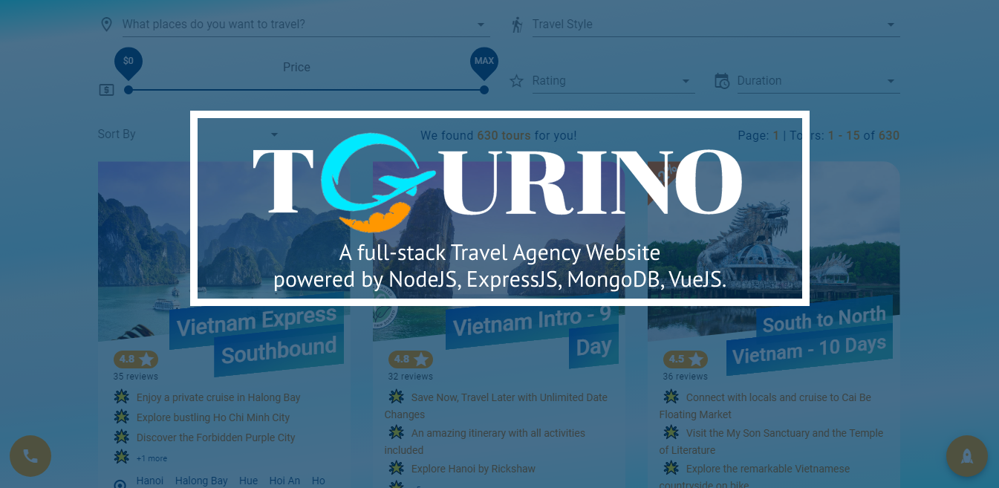
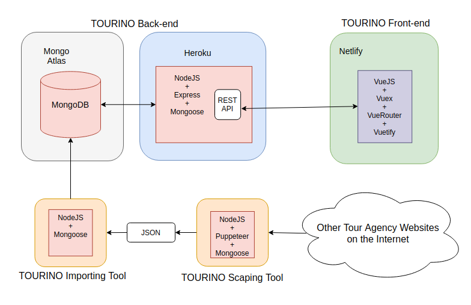

# 👋 Hi, I'm Thinh Nguyen, a Javascript Software Engineer!   

<p align="center">
</p>

```javascript
const thinh105 = {
  code: ["Javascript", "Typescript"],

  technology: {
    backEnd: ["NodeJs", "Express"],
    frontEnd: ["ReactJs", "NextJs"],
    database: ["MongoDB"],
    testing: ["Jest", "Testing Library"]
  },


  futureGoal: [
    "NestJs",
    "SQL",
    "Microservices",
    "Design Pattern",
    "GraphQL",
  ],

  education: [
    {
      university: "Hanoi University of Science and Technology",
      duration: [2010, 2011],
    },
    {
      university: "Pune University @ Pune - India",
      degree: "Bachelor in Computer Applications",
      duration: [2011, 2014],
    },
  ],
};
```

## ⚡ About my personal project 

<p align="center">

</p>

Tourino is a fullstack Travel Agency Website powered by NodeJS, ExpressJS, MongoDB, VueJS.

## 🎉 Live Demo: https://tourino.netlify.app/

> **⛔ Notice:**

**It will take a while ( around 10-15s) to wait and fetch data when you visit my website the first time.**

Because I run the Tourino's backend under the free package on Heroku, my API server will sleep after 30m of inactivity.

I want to play fair and will not use some tricks to abuse their server every 29 minutes just to keep my small project from sleeping.

It's kind of a feature, not a bug! 😅 😆

## 📋 Application Architecture Diagram

<p align="center">

</p>

## 💻 Code Base

It contains three parts (`Tourino Importing Tool` is inside the `Tourino-Backend-NodeJS`):

<p>
<a href="https://github.com/thinh105/Tourino-Backend-Nodejs">
        </a>

<a href="https://github.com/thinh105/Tourino-Frontend-VueJS">
        </a>
</p>

<p>
<a href="https://github.com/thinh105/Tourino-Scraper-Nodejs"></a>
</p>

## 📝 [My Resume](https://github.com/thinh105/thinh105/raw/main/ThinhNguyen-NodeReact.pdf)

## 📞 Contact me:

<a href="https://join.skype.com/invite/VKgAolbnQdNP">
  
</a>
<a href="https://www.linkedin.com/in/thinh105/">
  
</a>
<a href="mailto:maxiqboy @ gmail . com/">
  
</a>
<a href="https://www.messenger.com/t/Thinh105">
  
</a>
<a href="091 682 7859">
  
</a>
