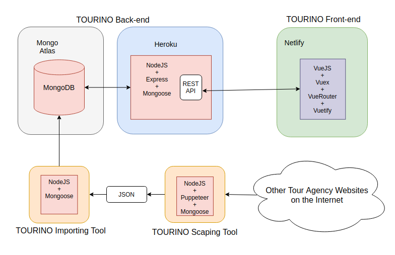

# 👋 Hi, I'm Thinh Nguyen, a Junior JavaScript developer!   

<p align="center">
</p>

```javascript
const thinh105 = {
  code: ["Javascript", "HTML", "CSS"],

  technologies: {
    backEnd: ["Node", "Express"],
    frontEnd: ["Vue", "Vuex", "Vue Router", "Vuetify"],
    database: ["MongoDB", "Mongoose"],
  },

  lookingFor: "Backend job on NodeJS",

  futureGoal: [
    "Microservices",
    "Design Pattern",
    "Docker",
    "Jest",
    "Typescript",
    "SQL",
    "Vue 3",
    "Nuxt",
  ],

  wannaTry: ["Deno", "React", "Svelte"],

  education: [
    {
      university: "Hanoi University of Science and Technology",
      duration: [2010, 2011],
    },
    {
      university: "Pune University @ Pune - India",
      degree: "Bachelor in Computer Applications",
      duration: [2011, 2014],
    },
  ],
};
```

## 📊 My stats 

<p align="center">My Stack Overflow <a href="https://stackoverflow.com/users/2620022/thinh-nv?tab=profile"</a><p>
<p align="center">
<a href="https://stackoverflow.com/users/2620022/thinh-nv"></a></p>

<p align="center">My Github<p>
<p align="center">
</p>

<p align="center" justify="center"> </p>

<p align="center"> These stats was generated using <a href="https://github.com/anuraghazra/github-readme-stats">Github Readme Stats project</a> and <a href="https://stackoverflow.com/questions/63376500/how-do-i-add-my-stack-overflow-reputation-as-a-live-badge-on-github">StackOverFlow Flair Feature.</a></p>

## ⚡ About my personal project 

<p align="center">

</p>

Tourino is a fullstack Travel Agency Website powered by NodeJS, ExpressJS, MongoDB, VueJS.

## Live Demo:

## https://tourino.netlify.app/

> **Notice:**

**It will take a while ( around 10-15s) to wait and fetch data when you visit my Tourino website the first time.**

Because I run the Tourino's backend under the free package on Heroku, my API server will sleep after 30m of inactivity.

I want to play fair and will not use some tricks to abuse their server every 29 minutes just to keep my small project from sleeping.

It's kind of a feature, not a bug! 😅 😆

## Application Architecture Diagram

<p align="center">

</p>

## Code Base

**As Linus Torvalds said "Talk is cheap...", so here is my `code`!**

It contains three parts (`Tourino Importing Tool` is inside the `Tourino Backend Nodejs`):

<p>
<a href="https://github.com/thinh105/Tourino-Backend-Nodejs">
        </a>

<a href="https://github.com/thinh105/Tourino-Frontend-VueJS">
        </a>
</p>

<p>
<a href="https://github.com/thinh105/Tourino-Scraper-Nodejs"></a>
</p>

## 💬 My Story 

- 2014:

  - Graduated from [Pune University (India)](https://en.wikipedia.org/wiki/Savitribai_Phule_Pune_University) with a Bachelor in Computer Applications degree.

- 2014 - 2019:

  - Got several jobs as webmaster/IT technician in some small MMO teams.

- Late 2019 - 2020:

  - Quit the job and followed the web developer path.

- Now
  - I'm working on my personal project - a travel agency website named Tourino.
  - And now, I'm looking for a Backend job on NodeJS .

## 📝 [My Resume](https://github.com/thinh105/thinh105/raw/main/ThinhNguyen%20-%20CV%20-%20Junior%20NodeJS%20Developer.pdf)

## 📞 Contact me:

<a href="https://www.messenger.com/t/Thinh105">
  
</a>
<a href="https://www.linkedin.com/in/thinh105/">
  
</a>
<a href="mailto:maxiqboy @ gmail . com/">
  
</a>
<a href="091 682 7859">
  
</a>
